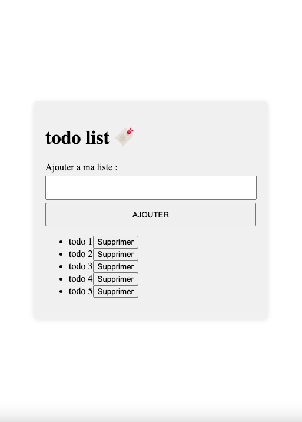

<h1>Todolist Project</h1>

This project is a simple web-based Todolist implemented using HTML, CSS, and JavaScript. It provides a user-friendly interface for managing tasks and activities.

<h3>Features</h3>
<ul>
  <li>Add new tasks to the list</li>
  <li>Mark tasks as completed</li>
  <li>Delete tasks from the list</li>
  <li>Responsive design using HTML and CSS for layout and styling</li>
  <li>Interactive functionality powered by JavaScript</li>
</ul>

<h3>Technologies Used</h3>
<ul>
  <li>HTML: Provides the structure of the Todolist interface.</li>
  <li>CSS: Styles the Todolist layout and appearance.</li>
  <li>JavaScript: Implements the Todolist logic and user interactions.</li>
</ul>

